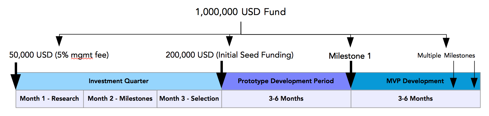

# Token Fund Team Founding Document

!> This is a draft - Work in Progress

### Mandate

The token fund team is an investment team responsible for finding, researching and helping to select the best projects for Elastos to kick start/seed invest in.
Each quarter the team will have a budget that is approved by the CRC, the secretariat will ensure that the request is reasonable and follow up on the KPIs.

?> It is important to note that the budgeted amount for each **investment quarter** is a **lifetime fund** for the projects selected by that quarter. For example a million dollar investment fund is only expected to be slowly distributed over a term of a year as each project hits their milestones.

### Key Rules

1. **Project Selection** - the CRC and the Token Fund Team will both select an equal number of projects to fund from a pool of qualified projects.
To ensure a healthy selection of candidates, the CRC can only select up to 35% of the candidates and the Token Fund Team may select another 35% (rounded down).

?> Feel free to comment on this ratio, or if the Council should even be allowed to choose candidates. I believe Kevin would prefer to be involved in selecting at least a couple candidates, but Rebecca originally envisioned the team make all selections.

2. **Funding by Milestones** - the Token Fund Team must clearly define multiple milestones for each project, a portion of the funding will be attached to each milestone.

3. **Investment Period of 1 Year** - after selection Cyber Republic will only fund the project for a maximum of one year after which it must reach a Minimum Viable Product (MVP).
Projects that cannot reasonably reach an MVP will not be considered by the Token Fund Team, instead they can be referred to the **Business Development Team**.

4. **Seed Investment Only** - our investments are meant to kick start the projects only to the MVP stage and are not meant to fund the project in its entirety.
It is expected that projects plan to raise funding through its own token or other means part way through their business plan. If this is not feasible it should be caught
in the project selection stage or as soon as possible at the milestones. Should this still happen an audit/review will be necessary and possible escalation to the CRC.

5. **Return of Unused Funds** - any projects that do not hit their required milestones will possibly no longer receive additional funding. Unused funds will be returned
to the Cyber Republic fund for investment in another quarter. If a milestone is missed an appeal can be submitted to the Token Fund Team within a month of the deadline,
the team will review the appeal and provide the review plus any supporting documents to the council for possible extension.

### Phase 1 - Jan 2019 - **Research/Collaboration Phase**

##### Working with the Best Candidates/Teams to Develop their Whitepapers

We will be working closely with the best teams we selected in Phase 1 on their business plans, whitepapers and technical designs.
The ultimate goal is to qualify a set of candidates for selection by the CRC and the Token Fund Team, this will be
run as a competition of sorts because in the Token Fund Team rules only a maximum 70% of the qualified applications will be funded.

### Phase 2 - Feb 2019 - **Milestone Phase**

##### Technical Design, Milestones and Business Development

At this phase the technical members of each project will work on defining reasonable milestones and set a timeline to reach the Minimum Viable Product (MVP).
Other members of each project's team will start basic business development initiatives such as networking and researching competing products.
As described in the Token Fund Team founding document the MVP must be built within 1 year and a plan to raise additional/continual funds must be in place.

### Phase 3 - Mar 2019 - **Selection Phase**

##### Submission of Proposals to Council and Selection Process

At the start of phase 3 the whitepapers will be presented to the Council,

### Policies

- The fund will be held by a multi-signature wallet owned by the lead investor, an Elastos Foundation member and the Secretariat

- All leads, opportunities and contacts must be entered into the CRM and shared with other members of the team

- Each quarter of the year, the team must submit a funding request document with KPIs/goals at the start.
At the end of the quarter another report is required describing the current state of all investments and comparisons with goals

- The team will take a **management fee equal to a percentage of the fund** which will be held in a separate wallet. From this wallet the members of the teams
will deduct their agreed upon pay on a semi-monthly basis in ELA. The management fee funds will also be used to create CR tasks for CRcles to help the Token Fund Team in any way necessary.

- Each project invested in will require an analysis report which includes information including but not limited to: funding, technical milestones, expected ROI, deliverables
and the contractual agreement on how many tokens will be allocated to Elastos

### Team Composition and Rationale

The team initially will be formed of three members

- **Lead Investor** - leads the token fund team, finds leads, defines the criteria to judge projects and has major decision making power over which projects are invested in

- **Assistant Investor** - assists other investors, manages financial records, goal estimation and following up with project milestones

- **Technical Adviser** - advises on which projects are feasible and helps review funding requirements to ensure they are realistic

#### Team Growth

The team will be selected from active and motivated individuals in the CR community and grow from there.

In the future we would like to hire more experienced investors with actual industry or VC experience. We are not looking for these right now, as the Token Team is still in its infancy and such investors would be too expensive.
We also believe that experienced investors are only necessary when we are trying to select a unicorn from many strong candidates, and where discerning which projects have the most potential is difficult.
Given the quality of applications we've seen so far we do not believe there will be enough amazing projects to warrant looking for stronger investors yet.

