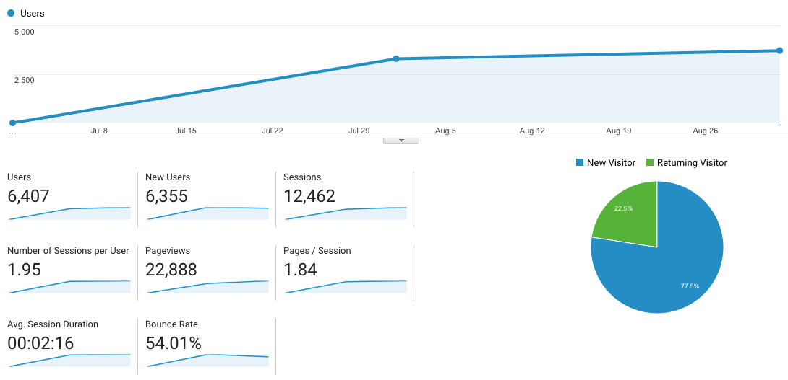

# KPI Report for 2018 Q3 (Work in Progress)

!> This is still a WORK IN PROGRESS!

?> This is the first KPI Report, it's important to note that no metrics were tracked until starting May 2018 when the US Tech Team officially came online.

This can be assumed to be first full quarter that the US Tech Team were able to focus on our KPIs. From May to June the team spent most of its time doing
tours and building a community and ambassadors in key regions.

## Development KPIs

### 1. CR Developers

| Developers        | Q2 | Q3         | Delta |
| ----------------- | -: |----------: | ----: |
| Leads             |    | 12         |       |
| | | | |
| Onboarded         |    | 7          |       |
| Lost              |    | 5          |       |
| <b>Conversion</b> |    | <b>58%</b> |       |
| | | | |
| Dormant           |    | 4          |       |
| Active            | 3  | 3          |       |
| <b>Retention</b>  |    | <b>57%</b> |       |

##### Total CR Developers: 6

### 2. Pivotal Tracker Velocity:

| Project      | Q2 | Q3 | Delta |
| ------------ | -: | -: | ----: |
| CR Website   | 23 | 33 | &#x25B2; 43%

### 3. Avg Bugs/Issues Opened and Closed:

##### CR Website

| Action           | Q2  | Q3  | Delta |
| ---------------- | --: | --: | ----: |
| Issues Reported  | 30  | 10  | &#x25BC; -66% |
| Issues Addressed | 9   | 26  | &#x25B2; +289% |

### 4. Pull Requests

| Project          | Q2  | Q3  | Delta |
| ---------------- | --: | --: | ----: |
| CR Website       | 36  | 144 | &#x25B2; +400% |

### 5. CR dApp Projects

| Type             | Q3  |
| ---------------- | --: |
| CR100            | 27  |
| Direct           | 22  |

---

## Technical KPIs

### 1. Opportunities (Copper CRM): **45**

### 2. Active R&D Projects: **3**

### 3. R&D Partnerships: **0**

---

## Community KPIs

### 1. Cyber Republic Users - Signups, Active:

Signups: **931**

Active: **269**

Retention: **29%**

### 2. Regions Represented Physically by Ambassadors: 17

1. China
2. United States
3. Canada
4. Japan
5. Singapore
6. Thailand
7. Australia
8. Vietnam
9. India
10. Hong Kong (Region)
11. France
12. UK
13. Spain
14. Germany
15. Belgum
16. Netherlands
17. Switzerland

---

## Marketing KPIs

